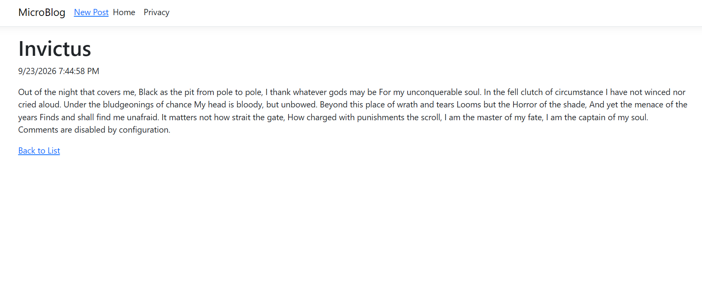
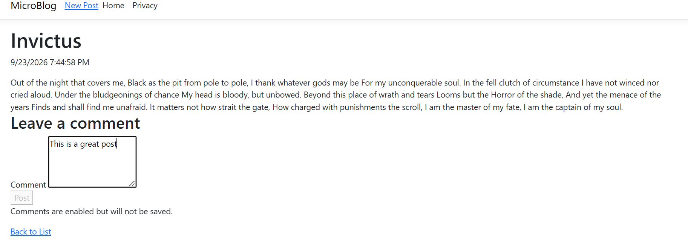
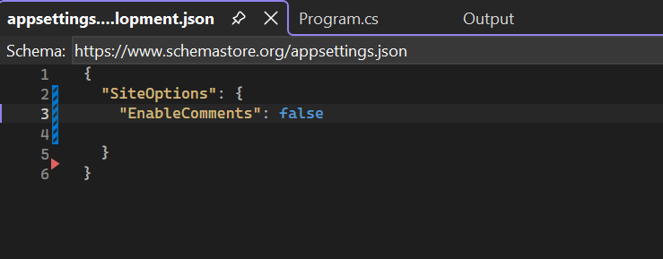
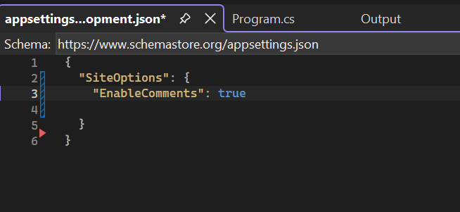

# Configuration & Options

## Project Description

This is an ASP.NET application (cloned from 9/23 MicroBlog) demonstrating configuration and options. The application uses configuration to control whether or not the comment form is displayed.

## How to Run

1. Open the project in Visual Studio.
2. Run the application in command prompt, and open in browser.
3. Open any blog post "Details" or "Read More" page.
4. When `EnableComments` is set to `false`, the comment form is hidden.
5. When `EnableComments` is set to `true`, the comment form is displayed.
6. Configuration is changed in appsettings.development.json and overrides the setting created in appsetting.json.

## Screenshots

### Comments Disabled

### Comments Enabled

### Disabled Configuration

### Enabled Development Configuration

